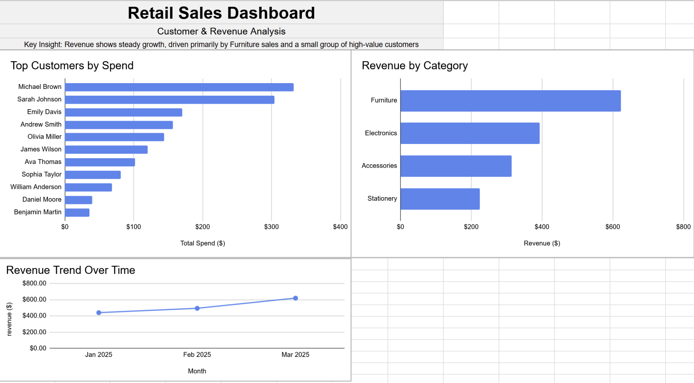

# Retail Sales Dashboard (SQL + Google Sheets)

## Overview

This project analyzes retail sales data using SQL and visualizes key business insights through a dashboard built in Google Sheets.

The objective was to transform raw transactional data into meaningful insights around customer behavior, revenue trends, and product performance.

---

## Dataset

The dataset simulates retail sales transactions and includes:

* Order ID
* Order Date
* Customer ID & Name
* Product & Category
* Quantity
* Price
* Discount
* Total Sales

---

## Key Analyses

* Top customers by total spend
* Revenue by product category
* Monthly revenue trends
* Customer segmentation (high vs low value)
* Product performance ranking using window functions
* Repeat customer behavior

---

## Dashboard Preview

The dashboard was built in Google Sheets using SQL query outputs to visualize key business insights.

This dashboard highlights customer spending patterns, category-level revenue, and monthly growth trends.

---

## Key Insights

* Revenue shows steady growth over time
* Furniture is the top-performing category
* A small group of customers drives the majority of total revenue
* Customer spending is highly concentrated among top buyers

---

## SQL Code

[View Full SQL Script](retail_sales_projects.sql)

---

## SQL Skills Demonstrated

* Aggregations (SUM, AVG, COUNT)
* GROUP BY analysis
* Common Table Expressions (CTEs)
* Window functions (RANK)
* CASE statements
* Date-based analysis (DATE_TRUNC)

---

## Tools Used

* PostgreSQL
* DBeaver
* Google Sheets (dashboard & visualization)
* GitHub

---

## Project Workflow

1. Wrote SQL queries to clean and analyze transactional data
2. Used aggregations and CTEs to calculate key metrics
3. Exported query results to CSV files
4. Built a dashboard in Google Sheets to visualize insights
5. Highlighted key findings for business decision-making

---

## Dashboard & Visualization

The dashboard was created in Google Sheets by importing CSV outputs from SQL queries.

Key features include:

* Bar chart of top customers by spend
* Revenue breakdown by product category
* Time-series analysis of monthly revenue trends
* Clean layout designed for business readability

This step bridges the gap between raw data analysis and business decision-making.

---

## What I Learned

* How to turn raw data into business insights
* Writing structured and efficient SQL queries
* Building clean, readable dashboards
* Communicating insights clearly

---

## Next Steps

* Build dashboards using Power BI or Tableau
* Work with larger, real-world datasets
* Add predictive analysis (forecasting revenue trends)
