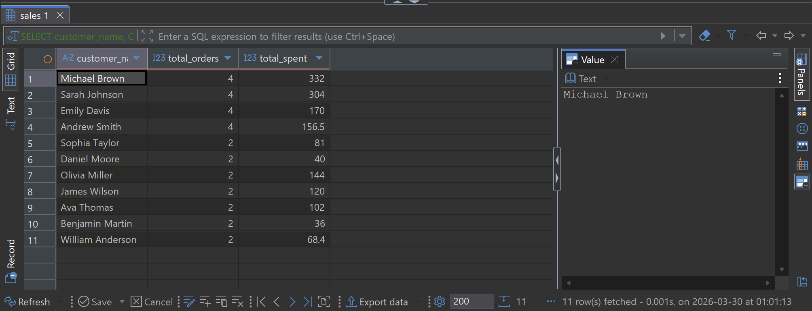

# Retail Sales Analytics SQL Project

## Overview
This project analyzes retail transaction data using SQL to uncover insights into revenue performance, customer behavior, and product trends.

## Tools Used
- PostgreSQL
- DBeaver
- SQL

## Dataset
Retail sales transaction data including:
- order_id
- order_date
- customer_name
- product_name
- category
- region
- quantity
- price
- discount
- total_sales

## Key Analyses
- Revenue by category and region
- Monthly sales trends
- Top customers by spending
- Customer segmentation (high, mid, low value)
- Product ranking using window functions
- Repeat customer analysis

## Key Insights
- A small group of customers drives the majority of revenue
- Electronics and Furniture are top-performing categories
- Repeat customers generate significant value
- Monthly trends highlight consistent revenue growth

## Skills Demonstrated
- SQL aggregation (SUM, AVG, COUNT)
- GROUP BY analysis
- CASE statements
- Window functions (RANK)
- Common Table Expressions (CTEs)
- Business-focused data analysis
## Sample Output

### Top Customers by Orders and Spending

## SQL Code

[View Full SQL Script](retail_sales_project.sql)
